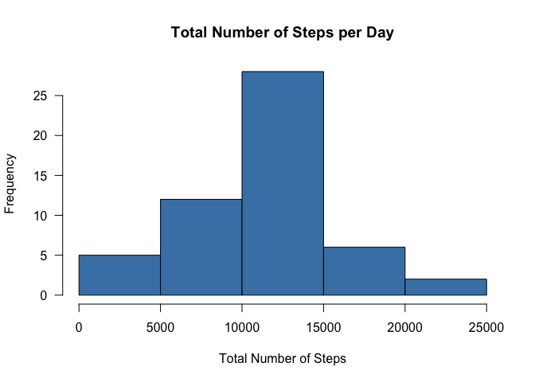
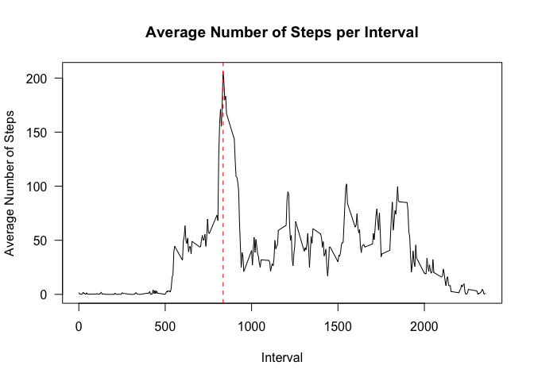
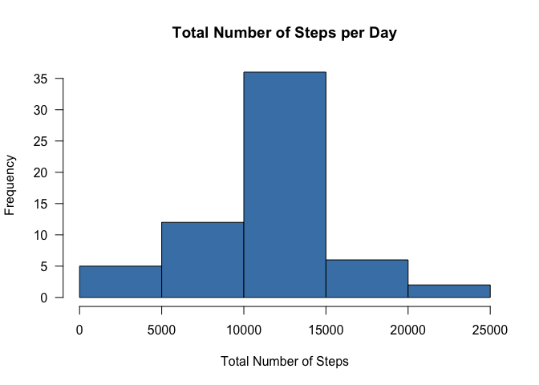
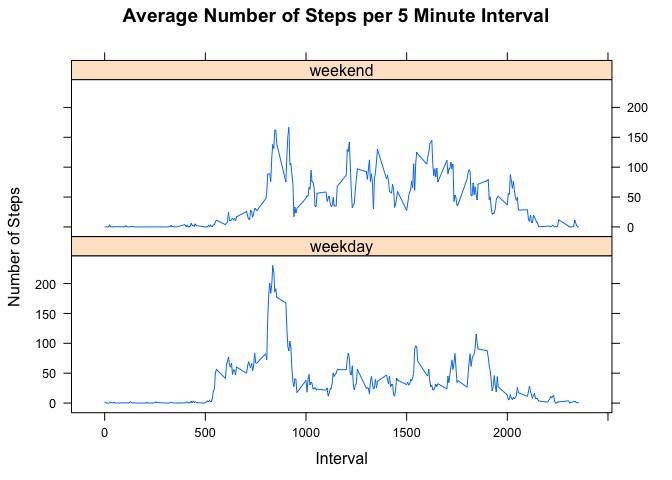

# PA1_template
Sonja White  
July 6, 2015  


#Introduction
Activity monitoring devices such as a Fitbit (http://www.fitbit.com), Nike Fuelband (http://www.nike.com/us/enus/c/nikeplusfuelband), or Jawbone Up (https://jawbone.com/up) collect a large amount of data about personal movement. This assignment analyzes data collected for an anonymous individual during the months of October and November 2012. The data collected includes the number of steps taken in 5 minute intervals each day. One of the goals of this analysis is to determine the average and median of the total number of steps taken per day and to look at the average daily activity pattern. Next, missing values are replaced with the mean for the missing interval across all days. Determine the average and median of the total number of steps taken per day and see if replacement of missing values affects the results. The final goal is to look at differences in activity patterns between weekdays and weekends.


##Load Data
Set the working directory, load necessary packages, and read in data. The data for the assignment can be downloaded from the course web site: Activity Monitoring data (https://d396qusza40orc.cloudfront.net/repdata%2Fdata%2Factivity.zip).

```r
setwd("~/Desktop/Coursera/Reproducible Research")
library(dplyr)
library(lattice)
activity_data <- read.csv("activity.csv")
```
##Calculate the Total Number of Steps per Day
Calculate the total number of steps taken per day and make a histogram of the total number of steps per day. 
Missing values are ignored

```r
total_steps <- summarize(group_by(activity_data, date), total = sum(steps))
par(las = 1)
with(total_steps, hist(total, col = "steelblue", main = "Total Number of Steps per Day", xlab = "Total Number of Steps"))
```

 

##Calculate the Mean and Median for the Total Number of steps taken per Day. Ignore missing values.

```r
mean <- mean(total_steps$total, na.rm = TRUE)
mean
```

```
## [1] 10766.19
```

```r
median <- median(total_steps$total, na.rm = TRUE)
median
```

```
## [1] 10765
```

##Calculate the Average Number of Steps Taken per Interval
Calculate the average number of steps taken per interval and make a time series plot of the 5-minute inteval (x-axis) and the 
average number of steps taken across all days( y-axis).  This will show the average daily activity pattern. Determine which 5-
minute interval on average across all days contains the maximum number of steps.

```r
avg_per_interval <- summarize(group_by(activity_data, interval), average = mean(steps, na.rm = TRUE))
par(las = 1)
with(avg_per_interval, plot(interval, average, type = "l", main = "Average Number of Steps per Interval", xlab = "Interval", 
                            ylab = "Average Number of Steps"))
max <- max(avg_per_interval$average, na.rm = TRUE)
max_int <- avg_per_interval[avg_per_interval$average == max, ]

abline(v=max_int[1,1], col = "red", lty = 2)
```

 

```r
max_int
```

```
## Source: local data frame [1 x 2]
## 
##   interval  average
## 1      835 206.1698
```


Maximum activity is occuring on average at 8:35 am

##Imput Value for Missing Data
Calculate and report the total number of missing values in the dataset (the number of rows with NA). Replace NAs with the mean for that interval across all day. Create a new dataset that is equal to the original dataset but with missing values filled in. Make a histogram of the total number of steps per day. 

```r
na <- sum(is.na(activity_data$steps))
na
```

```
## [1] 2304
```

```r
#Bind the column in the dataset avg_per_interval that contains the mean for each interval to the original dataset.
#If there is a missing value in the steps column, replace the missing value with the mean for that interval
combine <- cbind(activity_data, average = avg_per_interval$average)
combine$steps <- ifelse(!is.na(combine$steps), combine$steps, combine$average)

#Remove the column from combine that contains the means. Make a histogram of the total number of steps per day.
newdata <- combine[, c(1:3)]
total_steps <- summarize(group_by(newdata, date), total = sum(steps))
par(las = 1)
with(total_steps, hist(total, col = "steelblue", main = "Total Number of Steps per Day", xlab = "Total Number of Steps"))
```

 

##Calculate the mean and median for the Total Number of Steps Taken per Day with missing values filled in.

```r
mean <- mean(total_steps$total, na.rm = TRUE)
mean
```

```
## [1] 10766.19
```

```r
median <- median(total_steps$total, na.rm = TRUE)
median
```

```
## [1] 10766.19
```
Replacing the missing values does not significantly affect the mean and median.

##Look at differences in activity patterns between weekdays and weekends
Create a new factor variable in the dataset with two levels-"weekday", "weekend" indicating whether the date is a weekday or weekend day. Make a panel plot of the average number of steps taken averaged across all weekday days  and all weekend days.

```r
newdata$date <- as.Date(as.character(newdata$date), "%Y-%m-%d")
newdata <- mutate(newdata, wkday = (weekdays(date)))
newdata$wkday <- factor(ifelse(newdata$wkday %in% c("Saturday", "Sunday"), "weekend", "weekday"))

avg_steps <- summarize(group_by(newdata, interval, wkday), avg = mean(steps, na.rm = TRUE))
xyplot(avg ~ interval|wkday, data = avg_steps, type = "l", layout = c(1,2), xlab = "Interval", ylab = "Number of Steps", main = "Average Number of Steps per 5 Minute Interval")
```

 

Maximum activity occurs on average around 8:30am on weekdays and and a little later on weekends. The peak on weekends is less than the the peak for weekdays. There is more activity later in the day on weekends vs. weekdays.


